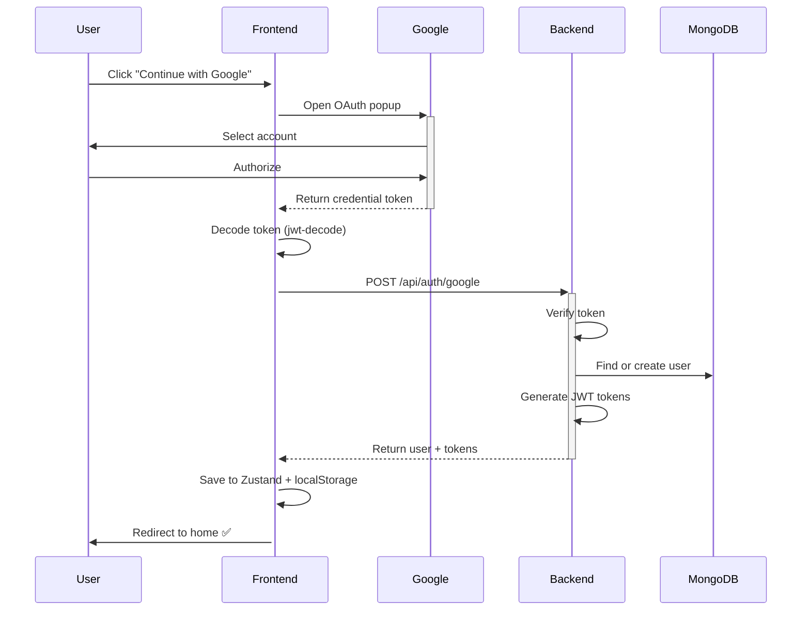

# 🔐 AUTHENTICATION: CHỈ GOOGLE OAUTH

## 📋 TÓM TẮT

Dự án này đã được đơn giản hóa để **CHỈ SỬ DỤNG GOOGLE OAUTH** cho authentication.

### ❌ Đã loại bỏ:

- ❌ Đăng ký bằng email/password
- ❌ Đăng nhập bằng email/password
- ❌ Quên mật khẩu / Reset password
- ❌ Email verification
- ❌ Form validation phức tạp

### ✅ Chỉ giữ lại:

- ✅ **Google OAuth Login** - 1-click đăng nhập
- ✅ Auto user creation từ Google account
- ✅ JWT access/refresh tokens
- ✅ Protected routes

---

## 🎨 GIAO DIỆN MỚI

### Login Page (`/login`)

- **Hiện đại & đơn giản**: Chỉ có nút "Continue with Google"
- **Responsive**: Desktop có branding bên trái, mobile tối ưu
- **Beautiful UI**: Gradient background, icons, feature highlights
- **No forms**: Không có input fields, không cần validate

### Navbar

- **Chưa đăng nhập**: Chỉ hiển thị 1 nút "Đăng nhập" với Google icon
- **Đã đăng nhập**: Avatar, notifications, messages, create post

### Register Page (`/register`)

- **Auto redirect**: Tự động chuyển về `/login`
- **No registration form**: Không có form đăng ký

---

## 🔧 CODE CHANGES

### Frontend

#### `web/frontend/src/pages/Auth/Login.jsx`

- ✅ Refactor hoàn toàn
- ✅ Chỉ hiển thị `GoogleLoginButton`
- ✅ Layout 2-column (desktop)
- ✅ Feature highlights
- ✅ Modern design

#### `web/frontend/src/pages/Auth/Register.jsx`

- ✅ Redirect về `/login`
- ✅ Không có registration form

#### `web/frontend/src/components/Auth/GoogleLoginButton.jsx`

- ✅ Component mới
- ✅ Sử dụng `@react-oauth/google`
- ✅ Handle success/error
- ✅ Call backend API

#### `web/frontend/src/components/Navbar/Navbar.jsx`

- ✅ Xóa nút "Đăng ký"
- ✅ Chỉ giữ nút "Đăng nhập" với Google icon

#### `web/frontend/src/components/Layout/AuthLayout.jsx`

- ✅ Đơn giản hóa layout
- ✅ Chỉ render `<Outlet />`
- ✅ Gradient background

#### `web/frontend/src/main.jsx`

- ✅ Wrap app với `GoogleOAuthProvider`
- ✅ Load Google Client ID từ env

### Backend

#### `web/backend/controllers/authController.js`

- ✅ Đã có sẵn `googleAuth()` function
- ✅ Auto create user nếu chưa tồn tại
- ✅ Auto verify email (vì từ Google)
- ✅ Generate JWT tokens
- ✅ Handle existing users

#### `web/backend/routes/authRoutes.js`

- ✅ Route `POST /api/auth/google` đã có
- ✅ Các routes khác vẫn giữ (nhưng frontend không dùng)

---

## 📦 DEPENDENCIES MỚI

### Frontend

```json
{
  "@react-oauth/google": "^0.12.1",
  "jwt-decode": "^4.0.0"
}
```

### Backend

Không cần cài thêm (đã có sẵn)

---

## 🚀 CÁCH HOẠT ĐỘNG

### Flow đăng nhập:



### User Creation Logic:

```javascript
// Backend: authController.googleAuth()
1. Tìm user bằng googleId HOẶC email
2. Nếu KHÔNG tìm thấy:
   - Tạo username từ email
   - Check username trùng → thêm timestamp nếu cần
   - Tạo user mới với:
     * googleId
     * email
     * username
     * avatar (từ Google)
     * isVerified: true
3. Nếu ĐÃ tồn tại:
   - Update googleId nếu chưa có
   - Update lastLoginAt
4. Generate JWT tokens
5. Return user + tokens
```

---

## 🔒 BẢO MẬT

### Ưu điểm:

1. ✅ **Không lưu password** - Google quản lý
2. ✅ **2FA tự động** - Nếu user bật 2FA trên Google
3. ✅ **Email verified** - Google đảm bảo email đã verify
4. ✅ **OAuth 2.0** - Standard protocol, battle-tested
5. ✅ **Less attack surface** - Ít code = ít bugs

### Điểm cần lưu ý:

- ⚠️ User phụ thuộc vào Google account
- ⚠️ Cần setup Google Cloud Console đúng cách
- ⚠️ Test mode chỉ cho phép test users
- ⚠️ Production cần verify OAuth consent screen

---

## 📝 ENV VARIABLES CẦN THIẾT

### Backend `.env`

```env
# Google OAuth
GOOGLE_CLIENT_ID=xxxxx.apps.googleusercontent.com
GOOGLE_CLIENT_SECRET=GOCSPX-xxxxx

# JWT (vẫn cần cho session management)
JWT_SECRET=your_jwt_secret
JWT_REFRESH_SECRET=your_jwt_refresh_secret
```

### Frontend `.env`

```env
# Google OAuth
VITE_GOOGLE_CLIENT_ID=xxxxx.apps.googleusercontent.com

# API URL
VITE_API_URL=http://localhost:5000/api
```

---

## 📚 SETUP GUIDE

Xem chi tiết tại: **[GOOGLE_OAUTH_SETUP.md](./GOOGLE_OAUTH_SETUP.md)**

### Quick Start:

1. Tạo Google OAuth credentials
2. Copy Client ID & Secret vào `.env`
3. Start backend: `cd web/backend && npm run dev`
4. Start frontend: `cd web/frontend && npm run dev`
5. Visit: http://localhost:3000/login
6. Click "Continue with Google" ✅

---

## 🎯 LỢI ÍCH CHO ĐỒ ÁN

### Tại sao chọn Google-only auth?

1. **⏰ Tiết kiệm thời gian**
   - Không cần code email verification
   - Không cần code forgot password
   - Không cần setup email service (Nodemailer, SendGrid, etc.)
2. **🐛 Ít bugs hơn**
   - Ít code hơn = ít bugs hơn
   - Google xử lý edge cases
3. **🔐 An toàn hơn**
   - Không lưu password
   - Google security team lo
4. **🎓 Phù hợp đồ án**
   - Focus vào AI features (toxic detection, emotion analysis)
   - Đơn giản nhưng đủ professional
   - Modern approach (nhiều app hiện đại chỉ dùng OAuth)
5. **👥 Better UX**
   - 1-click login
   - Không cần nhớ password
   - Mobile-friendly

---

## ✨ FEATURES VẪN HOẠT ĐỘNG

- ✅ JWT access/refresh tokens
- ✅ Protected routes
- ✅ User sessions
- ✅ Auto-login (localStorage)
- ✅ Logout
- ✅ User profile management
- ✅ Avatar từ Google
- ✅ Badge system
- ✅ Permissions (canPost, canComment)
- ✅ Admin/Moderator roles

---

## 🔮 FUTURE IMPROVEMENTS (optional)

Nếu muốn mở rộng sau này:

1. **Multi OAuth Providers**

   - Facebook Login
   - GitHub Login
   - Microsoft Login

2. **Email/Password (optional fallback)**

   - Cho users không có Google
   - Vẫn khuyến khích dùng OAuth

3. **Magic Link Login**
   - Email passwordless link
   - No registration needed

Nhưng **CHO ĐỒ ÁN NÀY**, chỉ Google OAuth là đủ! 🎉

---

**Updated:** 2024-10-27  
**Status:** ✅ Production Ready
